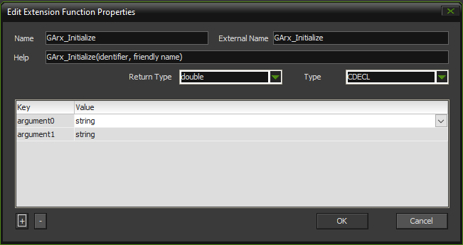

+++
title = "Using third-party SDKs with GameMaker"
date = 2021-08-02
description = "Wrapping third-party libraries to work with GameMaker: Studio"
+++

GameMaker is a fantastic tool with many functionalities for game development built in.
We used it to create [Void Invaders] and
right until the final stages of development, all we needed were the tools provided by GameMaker.
Sometimes though GameMaker's functionality might not be enough. Or maybe you want to integrate with a
library like Logitech's [Arx Control SDK]. If you're lucky, the library provides bindings for
GameMaker, and using it is a matter of including the plugin in your game project. Most of the time
you're out of luck.

[Void Invaders]: https://store.steampowered.com/app/391170/Void_Invaders
[Arx Control SDK]: https://www.logitechg.com/en-us/partnerdeveloperlab/sdk-resource-list/arx-control-sdk.html

<!-- more -->

Or are you? What if I told you that it's not even that difficult to integrate a library like Arx Control?

In this article I'll briefly go into how we ended up using the Arx Control SDK in Void Invaders,
and along the way you'll hopefully learn a bit more about GameMaker (and also some C++).
Note that this article has been written with GameMaker: Studio 1 and Windows in mind, because that's
what we used for Void Invaders. It's probably possible to adapt this to other platforms and other
versions of GameMaker, but we'll focus on GMS 1 and Windows.

## Arx Control SDK

First off, some background information on the Arx Control SDK. Logitech Arx Control is a system
where games can communicate with an app on the player's smartphone (iOS/Android). This way the game
can provide a second screen experience with things like health, minimaps and status information.

The client side (ie. the smartphone) displays HTML pages sent by the game, and receives update
events. The game uses the Arx Control SDK (a Windows DLL) to send pages and updates to the client.
However, this DLL is incompatible with GameMaker out of the box, but still we would like to use it.

The incompatibility arises because GameMaker in practice only supports two data types when talking
to external DLLs: strings (mapping to `char*` in C/C++) and reals (mapping to `double`).
Yes, this means GameMaker doesn't even have booleans.
In fact, any value below `0.5` is accepted as false, while values above `0.5` are true.
The `true` and `false` keywords are simply aliases for `1` and `0`.

Anyway, some of the exported functions in the Arx Control DLL reference other types, and so we can't
call these functions from GameMaker directly.

The SDK's C/C++ header defines a bunch of functions, but we're interested in the following:
```c++
bool LogiArxInit(wchar_t * identifier, wchar_t * friendlyName, logiArxCbContext *callbackContext);
bool LogiArxAddFileAs(wchar_t * filePath, wchar_t * fileName, wchar_t *mimeType = L"");
bool LogiArxSetIndex(wchar_t * fileName);
bool LogiArxSetTagPropertyById(wchar_t * tagId, wchar_t * prop, wchar_t *newValue);
bool LogiArxSetTagsPropertyByClass(wchar_t * tagsClass, wchar_t * prop, wchar_t *newValue);
bool LogiArxSetTagContentById(wchar_t * tagId, const wchar_t *newContent);
bool LogiArxSetTagsContentByClass(wchar_t * tagsClass, const wchar_t *newContent);
int LogiArxGetLastError();
void LogiArxShutdown();
```

## Creating a wrapper library

Instead of calling into the Arx Control DLL, what we will do is create a wrapper library
in C++ that uses only strings and doubles in its public interface. This wrapper DLL will
then take care of loading the actual DLL and calling its functions with the proper arguments.

Creating a new DLL project is easy using Visual Studio, but any editor/compiler combination *should*
work fine as long as it can produce Windows DLLs. Our basic wrapper will consist of a header and a
source file.

First, we'll define some functions for managing the Arx Control DLL:

`main.h`
```c++
#ifndef LOGITECH_WRAPPER_H
#define LOGITECH_WRAPPER_H

#include <windows.h>
#include "LogitechGArxControlLib.h"

// Name of the actual DLL file
#define LIBRARY_NAME "LogitechGArxControlEnginesWrapper.dll"

// Global library handle
HINSTANCE hLibrary = NULL;

// Shorthand annotation for exported functions
#define GMEXPORT __declspec(dllexport) __cdecl

// Exported functions
extern "C"
{
    double GMEXPORT GArx_InitializeDLL();
    double GMEXPORT GArx_LoadedDLL();
    double GMEXPORT GArx_FreeDLL();
}

#endif // LOGITECH_WRAPPER_H
```

The function prototypes are enclosed by an `extern "C"` block to prevent C++'s [name mangling];
name mangling is a process where C++ symbol names are transformed to conform to C naming rules. We don't
want this, because then we have no idea what our functions are called when we compile our DLL.

[name mangling]: https://en.wikipedia.org/wiki/Name_mangling

Each function is annotated with the `GMEXPORT` macro. This is a shorthand for functions exported
by our wrapper DLL, with `__cdecl` [calling convention]. What this means is not that important;
it just makes sure GameMaker can correctly call into the functions that our DLL exports.
(This will be important later.)

[calling convention]: https://en.wikipedia.org/wiki/Calling_convention

Let's implement them as well:

`main.cpp`
```c++
#include <windows.h>
#include "main.h"

// Load the Arx DLL.
// If successful (or already loaded), returns 1 ("true" in GameMaker).
// Otherwise returns 0 ("false" in GM).
double GMEXPORT GArx_InitializeDLL()
{
    if (hLibrary) return 1;

    hLibrary = LoadLibrary(LIBRARY_NAME);

    if (hLibrary)
    {
        return 1;
    }

    return 0;
}

// Check whether the Arx DLL is loaded.
double GMEXPORT GArx_LoadedDLL()
{
    if (!hLibrary) return 0;

    return 1;
}

// Free the Arx DLL.
// If the library wasn't loaded, returns 0/false, otherwise returns 1/true.
double GMEXPORT GArx_FreeDLL()
{
    if (!hLibrary) return 0;

    FreeLibrary(hLibrary);
    hLibrary = NULL;

    return 1;
}
```

## Making our library actually do something

Currently, our DLL doesn't do much apart from loading and releasing the Arx DLL using the `LoadLibrary()`
and `FreeLibrary()` functions from the Win32 API. To change that, we need to obtain the addresses
of the functions we want to call from the Arx DLL. Once we have pointers to these functions,
we can start writing wrapper functions that call the functions with proper arguments.

First, we'll need to define the function pointers to all of the functions we want to use:

`main.h`
```c++
...

// Library handle
HINSTANCE hLibrary;

// Function pointers
typedef bool(*fpInit)(wchar_t*, wchar_t*, logiArxCbContext*);
typedef bool(*fpAddFileAs)(wchar_t*, wchar_t*, wchar_t*);
typedef bool(*fpSetIndex)(wchar_t*);
typedef bool(*fpSetTagPropertyById)(wchar_t*, wchar_t*, wchar_t*);
typedef bool(*fpSetTagsPropertyByClass)(wchar_t*, wchar_t*, wchar_t*);
typedef bool(*fpSetTagContentById)(wchar_t*, const wchar_t*);
typedef bool(*fpSetTagsContentByClass)(wchar_t*, const wchar_t*);
typedef int(*fpGetLastError)();
typedef bool(*fpShutdown)();

fpInit initFunction;
fpAddFileAs addFileAsFunction;
fpSetIndex setIndexFunction;
fpSetTagPropertyById setTagPropertyByIdFunction;
fpSetTagsPropertyByClass setTagsPropertyByClassFunction;
fpSetTagContentById setTagContentByIdFunction;
fpSetTagsContentByClass setTagsContentByClassFunction;
fpGetLastError getLastErrorFunction;
fpShutdown shutdownFunction;

...
```

If this looks confusing, I'm right there with you: function pointer syntax in C and C++ sucks.
Basically, the `typedef`s define the types of pointers to functions, and below it we define
some global variables using these types. Now all that's left to do before we can start using them
is to initialize these variables with the right addresses of functions:

`main.cpp`
```c++
double GMEXPORT GArx_InitializeDLL()
{
    if (hLibrary) return 1;

    hLibrary = LoadLibrary(LIBRARY_NAME);

    if (hLibrary)
    {
        initFunction = (fpInit)GetProcAddress(hLibrary, "LogiArxInit");
        addFileAsFunction = (fpAddFileAs)GetProcAddress(hLibrary, "LogiArxAddFileAs");
        setIndexFunction = (fpSetIndex)GetProcAddress(hLibrary, "LogiArxSetIndex");
        setTagPropertyByIdFunction = (fpSetTagPropertyById)GetProcAddress(hLibrary, "LogiArxSetTagPropertyById");
        setTagsPropertyByClassFunction = (fpSetTagsPropertyByClass)GetProcAddress(hLibrary, "LogiArxSetTagsPropertyByClass");
        setTagContentByIdFunction = (fpSetTagContentById)GetProcAddress(hLibrary, "LogiArxSetTagContentById");
        setTagsContentByClassFunction = (fpSetTagsContentByClass)GetProcAddress(hLibrary, "LogiArxSetTagsContentByClass");
        getLastErrorFunction = (fpGetLastError)GetProcAddress(hLibrary, "LogiArxGetLastError");
        shutdownFunction = (fpShutdown)GetProcAddress(hLibrary, "LogiArxShutdown");

        if (!initFunction || !addFileAsFunction || !setIndexFunction
            || !setTagPropertyByIdFunction || !setTagsPropertyByClassFunction
            || !setTagContentByIdFunction || !setTagsContentByClassFunction
            || !getLastErrorFunction || !shutdownFunction)
        {
            FreeLibrary(hLibrary);
            hLibrary = NULL;

            return 0;
        }

        return 1;
    }

    return 0;
}
```

Now, at any point between calls to `GArx_InitializeDLL()` and `GArx_FreeDLL()`, if
`hLibrary` is not `NULL`, our function pointers point to the right functions, and we can start
calling them.

`main.h`
```c++
...

// Exported functions
extern "C"
{
    double GMEXPORT GArx_InitializeDLL();
    double GMEXPORT GArx_LoadedDLL();
    double GMEXPORT GArx_FreeDLL();

    double GMEXPORT GArx_Initialize(char*, char*);
    double GMEXPORT GArx_AddFileAs(char*, char*, char*);
    double GMEXPORT GArx_SetIndex(char*);
    double GMEXPORT GArx_SetTagPropertyById(char*, char*, char*);
    double GMEXPORT GArx_SetTagsPropertyByClass(char*, char*, char*);
    double GMEXPORT GArx_SetTagContentById(char*, char*);
    double GMEXPORT GArx_SetTagsContentByClass(char*, char*);
    double GMEXPORT GArx_GetLastError();
    double GMEXPORT GArx_Shutdown();
}

...
```

`GArx_GetLastError()` and `GArx_Shutdown()` are the easiest to implement, so we'll start by doing that:

`main.cpp`
```c++
...

double GMEXPORT GArx_GetLastError()
{
    if (!hLibrary) return -1;

    return static_cast<double>(getLastErrorFunction());
}

double GMEXPORT GArx_Shutdown()
{
    if (!hLibrary) return -1;

    shutdownFunction();

    return 0;
}
```

If the Arx DLL isn't loaded (ie. `hLibrary` is `NULL`), we'll return `-1` to GameMaker. Other than
that, it's a matter of calling the respective functions.

This is a bit different for the other functions, because they take `wchar_t*` strings and not `char*`
like GameMaker. Luckily Windows' API has the `MultiByteToWideChar()` function, which we can use
to convert the (UTF-8 encoded) `char*` strings to `wchar_t*` strings. We'll have to do this a couple
of times, so let's create a utility function for it:

`main.cpp`
```c++
#include <string>
#include <cstring>
#include <windows.h>
#include "main.h"

wchar_t* sToWcs(char* str)
{
    int slen = std::strlen(str) + 1;
    int len = MultiByteToWideChar(CP_UTF8, 0, str, slen, nullptr, 0);
    wchar_t* buf = new wchar_t[len];
    MultiByteToWideChar(CP_UTF8, 0, str, slen, buf, len);
    return buf;
}

...
```

Using `sToWcs()`, implementing the rest of the functions is a breeze. Below is the implementation of
`GArx_Initialize()`; the others are very similar.

`main.cpp`
```c++
...

double GMEXPORT GArx_Initialize(char* identifier, char* friendlyName)
{
    if (!hLibrary) return -1;

    wchar_t* wsIdentifier = sToWcs(identifier);
    wchar_t* wsFriendlyName = sToWcs(friendlyName);

    bool result = initFunction(wsIdentifier, wsFriendlyName, nullptr);

    delete[] wsIdentifier;
    delete[] wsFriendlyName;

    return static_cast<double>(result);
}

...
```

Whew. I may have slightly overstated how easy this would be (it took me a good couple days to figure it all out).
That's all the code we'll have to write for now, though. We can go ahead and compile our wrapper to
a DLL and include it in our game alongside the Arx Control DLL.

## Wrapping it all up

Now that we have our wrapper DLL, we can start using it in GameMaker. We'll create a new extension
(right click Extensions &RightArrow; Create Extension). Give it a descriptive name, eg. "LogitechGArx";
the other settings can remain default. Then, we'll add both the Arx Control DLL
(which is, confusingly, called <code>Logitech&shy;GArx&shy;Control&shy;Engines&shy;Wrapper.dll</code>) and our wrapper
by right click clicking LogitechGArx &RightArrow; Add File. Last off, we can start adding our functions
one-by-one! To do this, right click the wrapper DLL &RightArrow; Add Function.



The name is what we will use to call the function in GameMaker. Its *External Name* is whatever the
exported name in our wrapper library was; in our case, `GArx_Initialize`. *Help* is a help
message that shows when auto-completing the function. Usually you want this to be the name of the
function and the list of parameters. You can select the return type to be `double` or `string`.
For our library, every function returns a `double`. *Type* is the calling convention. Which one you
use is not that important, just make sure it's the same as you defined earlier. I picked `cdecl` because
Arx Control uses `cdecl` as well. To be honest, I'm not sure if it matters, but this *seemed* to work
when we released Void Invaders. Parameters can be added using the `+`/`-` buttons. `GArx_Initialize`
takes two string parameters.

And there you have it! We're now be able to use `GArx_InitializeDLL()` and `GArx_FreeDLL()` in
GameMaker to load and unload the Arx Control DLL, and call its functions to use Arx Control with
our game! Hopefully, it won't be difficult to apply this approach to other libraries, too.

*Of course, I'm not a GameMaker, C++ or Windows programming expert -
if anything looks off or doesn't work, don't hesitate to [contact me](mailto:koen.bolhuis@gmail.com).*
